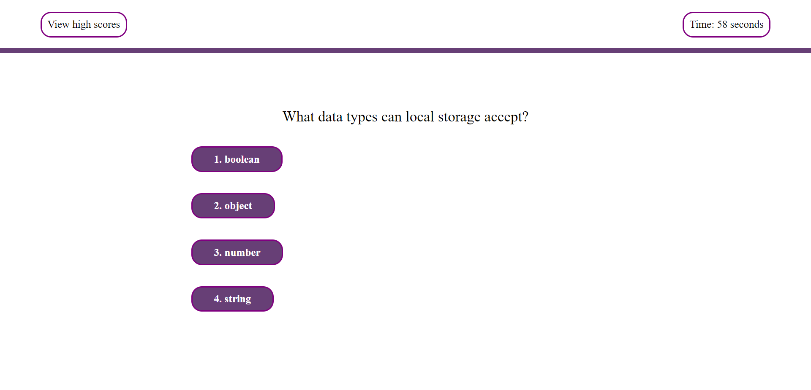

# Code Quiz

# Purpose
To take JavaScrip basis quiz in limited time with penalty of (-10 sec) for every wrong answer.

# Website

# Screenshot of Quiz 

# User Story 
GIVEN I am taking a code quiz
WHEN I click the start button
THEN a timer starts and I am presented with a question
WHEN I answer a question
THEN I am presented with another question
WHEN I answer a question incorrectly
THEN time is subtracted from the clock
WHEN all questions are answered or the timer reaches 0
THEN the game is over
WHEN the game is over
THEN I can save my initials and score

# Build with 
* HTML
* CSS
* JavaScript 
# Author
Halima Ikbal

# 🤝 Support 
Contributions, issues, and feature requests are welcome!
